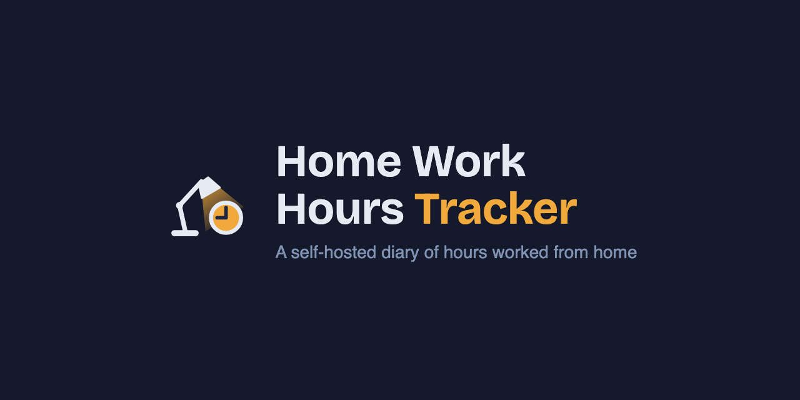
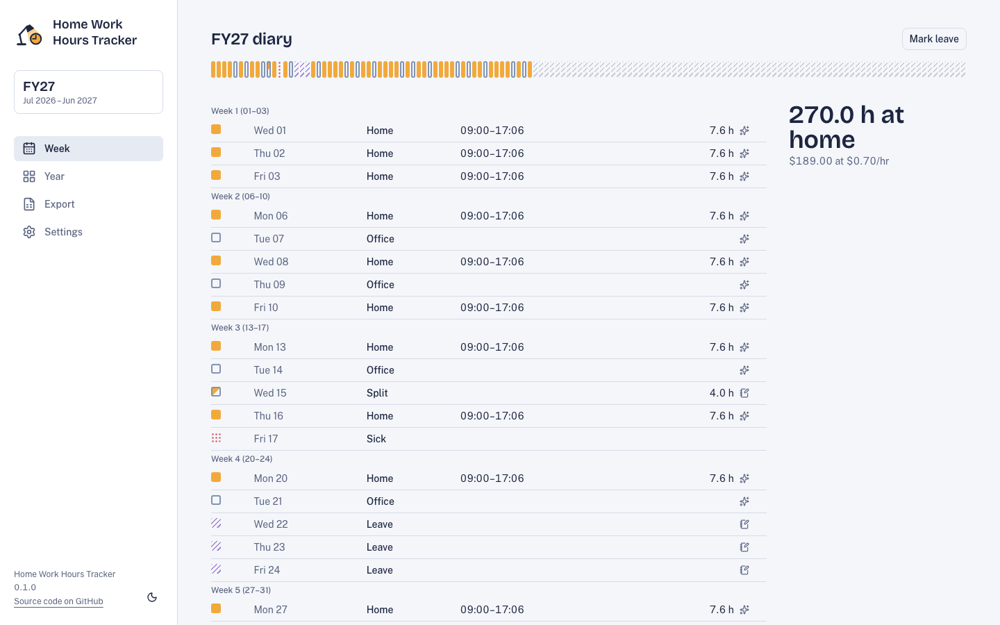
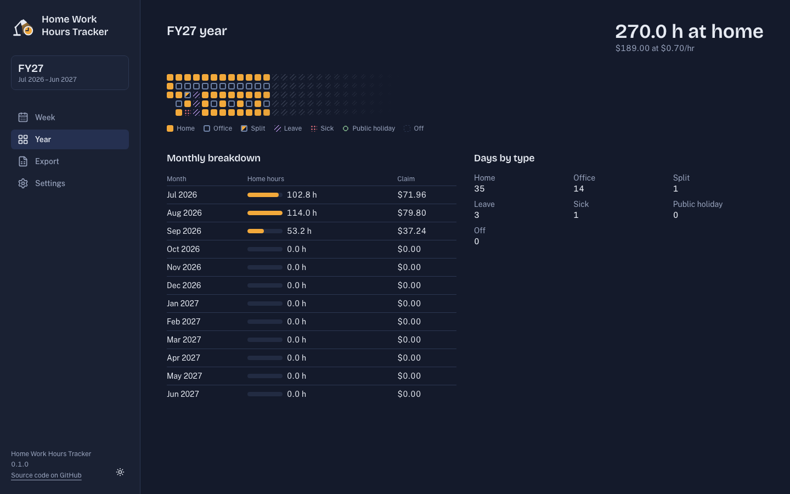
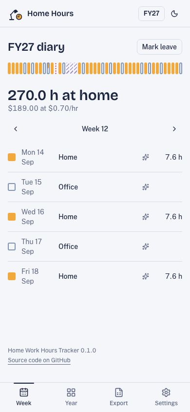
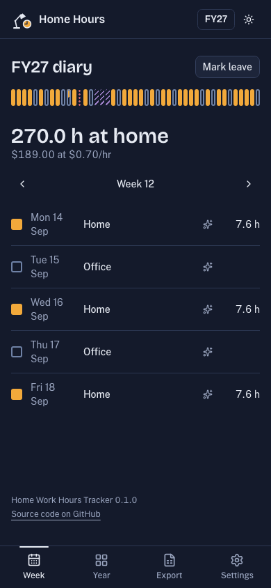

# Home Work Hours Tracker



A self-hosted, single-user diary of the hours you work from home, for the Australian financial year (1 July – 30 June). It's built for the ATO fixed-rate method: hours worked from home × the rate for that year.

- **Fills itself in.** Set your standard hours and a weekly or fortnightly schedule, and each day is filled from it, including public holidays for your state.
- **Override anything.** Split days, office days (with the office), leave, sick days and notes.
- **Accountant-ready export.** A styled spreadsheet with a summary and the full diary, with formulas the accountant can check.
- **Brings your old spreadsheets with you.** A guided import maps a legacy diary onto the new schema, row by row, before committing anything.
- **Mobile-first, desktop-ready.** Installable as a PWA, and deployed as a Docker container (Unraid template included).

Screenshots below are generated from the synthetic seed data (`npm run db:seed`) — "John Doe" at "Office Location 1/2" — never from a real diary.

|                                                                    |                                                                |
| ------------------------------------------------------------------ | -------------------------------------------------------------- |
|  |  |
|    |  |

## Quick start (development)

Requires Node 24.

```sh
cp .env.example .env
npm install
npm run dev
```

Optionally seed a synthetic demo dataset (a fortnightly office schedule, a split day, leave and a sick day, all for "John Doe"):

```sh
npm run db:seed
```

`npm run verify` runs lint, type checks, unit tests (100% coverage required) and Playwright end-to-end tests. See [AGENTS.md](AGENTS.md) for commands and conventions.

## Run it with Docker

```sh
docker build -t home-work-hours-tracker .
docker run -d \
  --name home-work-hours-tracker \
  -p 3000:3000 \
  -e TZ=Australia/Melbourne \
  -v $PWD/data:/data \
  home-work-hours-tracker
```

Or use the published image from GHCR:

```sh
docker run -d \
  --name home-work-hours-tracker \
  -p 3000:3000 \
  -e TZ=Australia/Melbourne \
  -v $PWD/data:/data \
  ghcr.io/brianramseyau/home-work-hours-tracker:develop
```

`:develop` is a moving tag rebuilt from every push to `main`, and `dev-<sha>` pins one exact commit if you need to hold a specific build. `:latest` tracks the most recent tagged release — use it once one exists (there's no release tag yet, so `:latest` doesn't either).

Open `http://localhost:3000`. `PUID`/`PGID` (defaults `99`/`100`, Unraid's `nobody:users`) control who owns the files under `/data`; set `TZ` to your local timezone, since that's what decides "today". The app installs as a PWA from the browser's install prompt.

### Unraid

Import [`unraid/home-work-hours-tracker.xml`](unraid/home-work-hours-tracker.xml) as a Community Applications template, or add the GHCR image (`ghcr.io/brianramseyau/home-work-hours-tracker`) manually. Unraid sets `TZ` and the `/data` mapping for you.

### Backups

Everything the app knows lives in one SQLite file at `/data/home-work-hours.db` (bind-mounted to `./data` above, or `/mnt/user/appdata/home-work-hours-tracker` under the Unraid template). Stop the container and copy that file to back it up or move it to a new host.

## Exporting for your accountant

Each financial year has an **Export** page with a live preview of the totals and a download button. The `.xlsx` it generates has two sheets: a **Summary** (key figures, a monthly breakdown with data bars, day-type counts) and a full **Diary** (one row per home-work block, with live formulas the accountant can audit rather than take on faith). Both carry a footer linking back to this repository.

## Privacy

This repository is public. Personal data never belongs in it: no real names, workplaces, addresses, work patterns or spreadsheets. Tests and demo data use placeholders like John Doe and "Office Location 1". A pre-commit hook and a CI check enforce this. See [AGENTS.md](AGENTS.md#-1-public-repo-no-pii-ever-read-first-applies-to-everything) if you're contributing.

Your own diary lives only in your SQLite database (`data/`, gitignored) — it never leaves your host.
